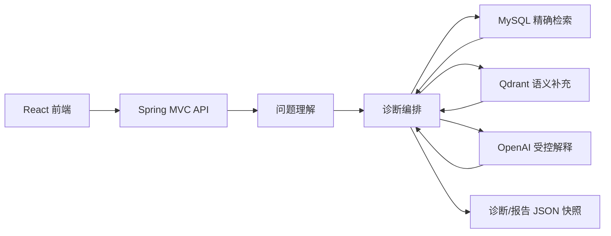
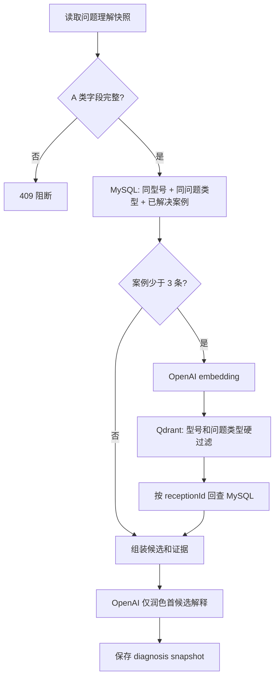

# 服务端实现说明

本文面向后续维护者，解释当前 V1 为什么这样实现、一次诊断如何流转，以及迭代时应该修改哪里。

## 1. 核心定位

服务端不是单纯的“向量搜索 + 大模型回答”。当前设计遵循三条原则：

1. **确定性优先**：能由字段、规则和 SQL 确定的内容，不交给 LLM 猜。
2. **知识与索引分离**：MySQL 保存业务事实，Qdrant 只做语义召回索引。
3. **证据约束生成**：OpenAI 只根据已检索候选与证据生成解释，不创造候选、部件或分数。



## 2. 运行组件

| 组件 | 职责 | 是否为事实源 |
| --- | --- | --- |
| Spring Boot | API、业务编排、规则与状态管理 | 否 |
| MySQL | 原始资料、知识对象、维修案例、会话与报告 | **是** |
| Qdrant | 维修问题向量和少量过滤 metadata | 否 |
| OpenAI Embeddings | 把问题投影转换为 512 维向量 | 否 |
| OpenAI Responses | 在已有候选和证据范围内生成中文解释 | 否 |

## 3. 一次完整链路

### 3.1 问题理解

入口：`POST /api/v1/problem-understandings`

实现：`ProblemUnderstandingService`

1. 从 taxonomy 已登记型号中识别设备型号。
2. 用正则识别错误码、温度等确定性字段。
3. 用规则识别运行状态、发生频率和近期变化。
4. `ProblemCatalogService` 根据型号、错误码、标准故障模式和口语别名匹配问题类型。
5. 生成 A/B/C 字段状态并保存 `problem_understanding_snapshot_v1`。

当前 A 类最小门槛是设备型号与非空症状文本。B 类缺失由前端强提醒，但服务端允许用户继续；
`continueWithoutRecommendedFields` 已在 API 中预留，当前尚未参与服务端校验。

### 3.2 出发前诊断

入口：`POST /api/v1/diagnosis-sessions`

实现：`DiagnosisService.start`



SQL 结果始终排在向量结果前面，合并时以 `receptionId` 去重，最多保留 8 个案例。
Qdrant 不返回完整答案，只返回 `receptionId`；案例正文必须回 MySQL 获取。

### 3.3 候选原因与支持分

候选只能来自 `cause_hypothesis` 种子数据，最多三条。没有合格案例、没有问题分类或没有已登记候选时，
系统允许返回 0 条候选并显示 `INSUFFICIENT_EVIDENCE`。

当前 V1 初始支持分公式：

```text
48
+ 问题分类支持分 * 0.25
+ min(16, 已解决案例数 * 2)
- (候选默认排序 - 1) * 11
```

最高封顶 95。分段为：

- `>= 80`：STRONG_SUPPORT
- `>= 65`：SUPPORTED
- `< 65`：NEEDS_CONFIRMATION

这个分数是**证据支持度，不是统计概率**。目前公式适合 Demo 的可解释排序，后续应使用标注案例集校准。

### 3.4 证据和行动建议

- 维修历史证据：来自入选且最终解决的维修事件。
- 备件证据：聚合同一批入选案例中实际使用的部件。
- 工具：按问题类型使用稳定规则生成。
- 维修步骤：从历史处置文本中按顺序切分、去重，最多五步。
- LLM：不能创造部件号、案例号、测量值或官方结论。

### 3.5 现场追问

入口：

- `POST /api/v1/diagnosis-sessions/{id}/onsite`
- `POST /api/v1/diagnosis-sessions/{id}/questions/{questionId}/responses`

问题来自 `cause_hypothesis.clarification_questions_json`。系统优先遍历当前排序靠前的候选，
一次只展示一个尚未回答的问题。回答归一成 `AnsweredSignal` 后调整该候选分数：

- 与异常方向一致：`+8`
- 正常/不存在等反证：`-18`
- 自由文本：`+3`
- 无法确认或跳过：`0`

满足“首位候选至少 75 分，并领先第二名至少 15 分”时收敛；否则最多追问三轮。
当前现场评分尚未逐条执行 `supporting_signals_json/conflicting_signals_json` 中的全部运算符，
这是下一阶段最值得升级的规则引擎位置。

### 3.6 报告保存

报告只在用户点击保存时生成。一个诊断会话最多保存一份报告，重复请求直接返回已有报告。
报告保存完整 `DiagnosisSession` JSON 快照，所以未来知识库和算法变化不会改变历史报告内容。

## 4. 知识构建 Pipeline

实现：`ExcelKnowledgeImporter`

固定知识包由三张表组成：

```text
客服受理记录（受付ID）
  -> 维修到访记录（受付ID / 作業ID，可多次）
    -> 部件使用明细（作業ID / 明細ID，可多条）
```

导入顺序：

1. 扫描每个 Excel 前 10 行，用关键列组合识别文件类型。
2. 原始文件写入 `source_file`，原始行 JSON 写入 `source_record`。
3. 按受付ID合并客服、到访和部件记录，形成一个独立维修事件。
4. 用线上同一套 taxonomy 给历史事件分类。
5. 创建 `knowledge_unit` 与不可变 `knowledge_unit_version`。
6. 创建问题投影和解决投影。
7. 建立知识到原始 Excel 行的来源链路。
8. 写入在线读模型 `repair_case_projection_v1`。
9. 对问题投影生成 embedding 并 upsert Qdrant。
10. Qdrant 成功后才将 MySQL 的 `indexed` 标记为 true。

启动时若案例投影已经存在，会跳过原始导入，但仍会重试 `indexed=false` 的向量。

## 5. 数据分层

| 数据层 | 主要表 | 用途 |
| --- | --- | --- |
| 原始事实 | `source_file`, `source_record` | 保留资料原貌和 Excel 行号 |
| 领域知识 | `problem_type`, `cause_hypothesis`, `knowledge_unit*` | 分类、候选、版本和来源关系 |
| 在线读模型 | `repair_case_projection_v1` | 低成本 SQL 检索和聚合 |
| 交互快照 | `problem_understanding_snapshot_v1`, `diagnosis_snapshot_v1` | 恢复当时结果 |
| 现场状态 | `onsite_session_state_v1` | 已回答信号和轮次 |
| 用户资产 | `saved_diagnosis_report_v1` | 用户主动保存的不可变报告 |

## 6. 失败与降级

| 失败点 | 当前行为 |
| --- | --- |
| OpenAI 未配置 | 跳过向量索引、语义召回和 AI 解释；SQL 主链路仍可运行 |
| Embedding 请求失败 | 返回空向量；不把批次标记为已索引 |
| Qdrant 不可用 | 返回空命中；继续使用 SQL 结果 |
| AI 解释失败 | 保留规则生成的候选解释 |
| A 类字段缺失 | 409，禁止诊断 |
| 无合格证据 | 返回 0 候选和 `INSUFFICIENT_EVIDENCE` |
| 现场旧问题被重复回答 | 409，要求刷新当前问题 |

## 7. 推荐阅读顺序

1. `application.yml`：看运行依赖和环境变量。
2. `V2/V3/V4` migration：看 taxonomy、检索策略、问题类型和候选原因。
3. `ExcelKnowledgeImporter`：看原始资料如何变成知识和向量。
4. `ProblemCatalogService`：看问题分类规则。
5. `ProblemUnderstandingService`：看自然语言如何变成问题模型。
6. `DiagnosisService.start`：看 SQL-first 诊断主链路。
7. `DiagnosisService.enterOnsite/answerOnsiteQuestion`：看现场闭环。
8. `OpenAiGateway` 和 `QdrantGateway`：看外部系统边界。

## 8. 后续迭代落点

| 目标 | 首选修改位置 |
| --- | --- |
| 新增问题分类 | Flyway `problem_type` 种子 + `ProblemCatalogService` |
| 新增候选原因/现场问题 | `cause_hypothesis` 种子 |
| 调整检索路径 | `DiagnosisService.start`，后续建议抽出 RetrievalPlanner |
| 调整候选评分 | `buildCandidates`, `rescoreCandidates`, `onsiteScoreDelta` |
| 新增服务手册证据 | 新 importer + knowledge projection + EvidenceGroup |
| 支持人工审核知识 | ingestion/publish 状态机和审核 API |
| 更换模型供应商 | 新 Gateway，实现同样的 embedding/explanation 语义 |
| 提升测试覆盖 | 为 taxonomy 匹配、评分、降级和三轮追问增加单元/集成测试 |

## 9. 当前技术债

1. `DiagnosisService` 同时承担 Planner、Retriever、Scorer 和 Report Service，后续应按能力拆分。
2. B 类继续分析的授权目前主要由前端控制，服务端参数尚未真正校验。
3. 现场评分仍是通用增减分，尚未完整执行每个 hypothesis 的结构化信号规则。
4. 维修步骤来自历史文本切分，尚未接入官方服务手册 Procedure。
5. 自动化测试目前只有 Spring Context 启动测试，缺少关键业务规则回归测试。
6. 启动时导入适合固定 Demo，正式知识更新应改为独立任务和可审核发布流程。
